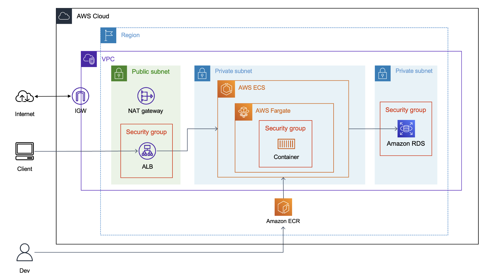
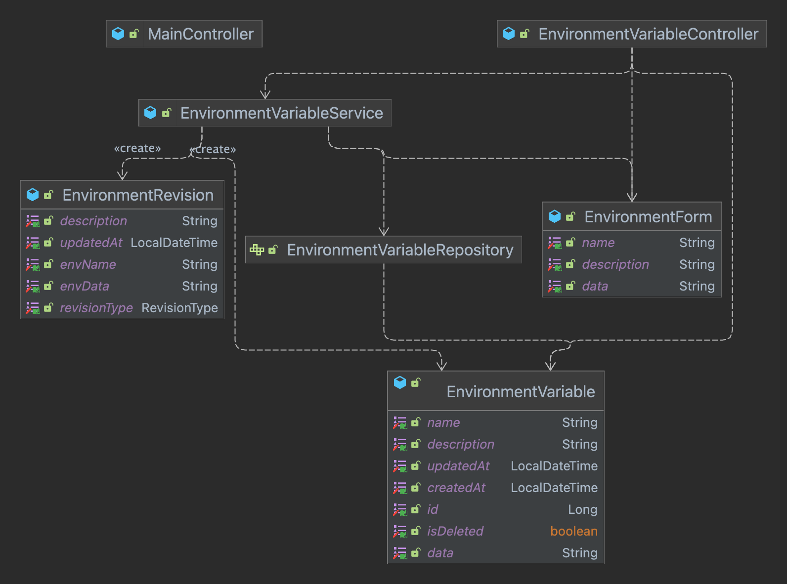
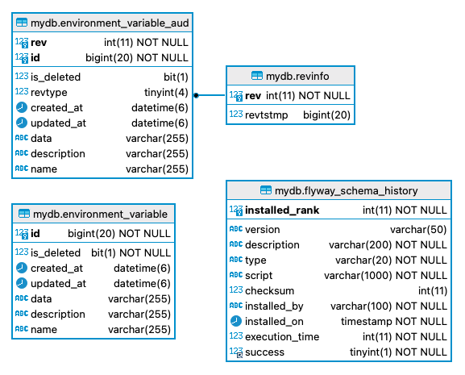

# Architecture

## 1. Cloud Architecture 


### 선택 이유

#### - RDS MariaDB

- 테이블과 컬럼을 사용하여 데이터를 구조화하고 효율적으로 관리할 수 있습니다. 
- 환경변수의 신뢰성과 정확성을 유지하기 위해 데이터 일관성과 무결성이 보장되어야 합니다. 
- 테이블 스키마를 정의하고 필요에 따라 필드를 수정할 수 있어 테이블 구조를 유연하게 관리할 수 있습니다.
- 환경변수를 저장하기 위한 테이블과 변경 이력을 관리하기 위한 테이블 간 관계를 구성하여 데이터 간 연결을 관리할 수 있습니다.

#### - ECS Fargate

- ECS는 프라이빗 서브넷에서 실행되어 외부에 직접 노출되지 않아 보안상 안전합니다. 
- 관리형 컨테이너 오케스트레이션 서비스로, 컨테이너 운영에 대한 부담을 줄일 수 있습니다. 
  - EKS는 섬세한 관리가 가능하지만, 복잡한 관리가 필요하지 않아서 오버스펙이라고 판단했습니다. 
- ECS Fargate는 서버리스 컨테이너 배포가 가능하여 인프라 관리 부담을 줄이고 단순한 배포와 관리가 가능합니다. 
  - EC2 인스턴스를 직접 프로비저닝하고 관리할 필요가 없어서 커스터마이징이 간단합니다. 
- AWS의 주요 서비스 중 하나로, 커뮤니티 활발성이 높고 다양한 관련 자료가 많아 기술적 문제가 생겼을 때 참고하기 좋습니다.


## 2. Class Diagram


- 컨트롤러 : [MainController](..%2Fsrc%2Fmain%2Fjava%2Fcom%2Fmanagement%2Fenv%2Fcontroller%2FMainController.java), [EnvironmentVariableController](..%2Fsrc%2Fmain%2Fjava%2Fcom%2Fmanagement%2Fenv%2Fcontroller%2FEnvironmentVariableController.java)
- 서비스 : [EnvironmentVariableService](..%2Fsrc%2Fmain%2Fjava%2Fcom%2Fmanagement%2Fenv%2Fservice%2FEnvironmentVariableService.java)
- 레포지토리 : [EnvironmentVariableRepository](..%2Fsrc%2Fmain%2Fjava%2Fcom%2Fmanagement%2Fenv%2Frepository%2FEnvironmentVariableRepository.java)
- 도메인 : [EnvironmentVariable](..%2Fsrc%2Fmain%2Fjava%2Fcom%2Fmanagement%2Fenv%2Fdomain%2FEnvironmentVariable.java)

### 구성요소 동작 방식

1. 사용자가 웹 페이지에 요청을 보내면, 해당 요청이 `컨트롤러`로 전달됩니다. 컨트롤러는 요청 처리에 필요한 데이터를 `서비스`에 전달합니다. 
2. `서비스`는 비즈니스 로직을 처리하며, 데이터 사용을 위해 `레포지토리` 메소드를 호출합니다.
3. `레포지토리`는 데이터베이스와의 상호작용을 담당하며 데이터의 영속성을 관리합니다. `도메인` 객체를 통해 데이터를 조회하고 변경합니다.
4. `컨트롤러`는 서비스로부터 반환받은 결과를 `뷰`에 전달해 사용자에게 보여줍니다. 
5. `뷰`는 받은 데이터를 이용해 웹 페이지를 구성합니다.


## 3. ERD



--- 

# Management

애플리케이션 로그 확인 및 애플리케이션 재시작을 위한 AWS CLI 사용 방법 안내입니다.   
이를 위해서는 AWS CLI가 설치되어 있고, 자격 증명이 구성되어 있어야 합니다.

## 1. 애플리케이션 로그 보기
가장 최근 이벤트 시간 기준으로 로그 스트림을 검색하여 로그를 실시간으로 읽어옵니다.

```shell
$ chmod +x ./script/tail.sh
$ sh ./script/tail.sh
```


## 2. 애플리케이션 재시작하기

애플리케이션을 재시작하기 위해 ECS 작업을 중지하고 다시 시작할 수 있습니다.   
가장 최근에 배포된 작업이 중지되고, 중지된 작업은 자동으로 다시 시작됩니다.

```shell
$ chmod +x ./script/restart.sh
$ sh ./script/restart.sh
```
